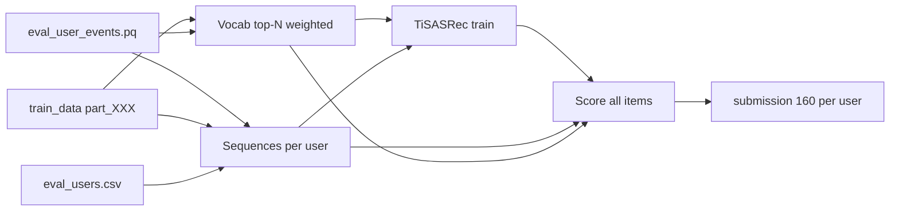

# TiSASRec — Avito ML Cup

End-to-end рекомендации на [TiSASRec](https://cseweb.ucsd.edu/~jmcauley/pdfs/wsdm20b.pdf) (PyTorch): следующий `item_id` по последовательности событий и **интервалам времени** между ними.

Профиль по умолчанию: **максимум сигнала из datafest**, умеренная регуляризация (dropout, weight decay, cap позиций на user), без «гигантской» модели ради переобучения.

---

## Расположение данных

Код ищет каталог с соревновательными файлами в таком порядке:

1. `DATA_DIR` из окружения  
2. `Tisasrec/datafest_2026_v2_v4/`  
3. `Tisasrec/data/`  
4. **сам каталог `Tisasrec/`** — если рядом с `train.py` лежат `eval_users.csv`, `train_data/`, …

Ожидаемая структура (после распаковки архивов):

```
Tisasrec/                          # или datafest_2026_v2_v4/
├── train.py
├── config.py
├── train_data/
│   ├── part_000.parquet           # user_id % 100 == 0
│   ├── …
│   └── part_099.parquet
├── eval_user_events.pq            # история eval-users до ~2026-04-15
├── eval_users.csv                 # 94 408 user_id → submission
├── item_features.parquet          # не используется TiSASRec (только seq)
├── contact_eids.csv
├── run.sh                         # Linux/macOS: train | predict
├── run.bat                        # Windows
├── artifacts/                     # model.pt, vocab.json, sequences.npz
└── submission.csv                 # после predict
```

---

## Что использует модель

| Источник | Назначение |
|----------|------------|
| `eval_user_events.pq` | основная история eval-пользователей |
| `train_data/part_*.parquet` | доп. история тех же users (шарды по `user_id % 100`) |
| `train_data` (все 100 part) | частоты для **словаря** top-N items |
| `contact_eids.csv` | вес ×5 для contact-событий в словаре |
| `eval_users.csv` | список users и padding сабмита |

**Cutoff:** `timestamp < 2026-04-08 UTC` (`CUTOFF_MS` в `config.py`) — как в `prepare_local_eval` и остальных моделях репозитория. Файл `eval_user_events` шире по датам; лишние события отсекаются фильтром.

**Seen items:** все `item_id`, уже встречавшиеся у user до cutoff (eval + train), не рекомендуются повторно.

**Submission:** `user_id,item_id` — ровно **160** строк на каждого из `eval_users.csv`.

---

## Запуск

### Linux / macOS

```bash
cd src/experiments/Tisasrec
chmod +x run.sh

./run.sh train -v
./run.sh predict -v --out submission.csv

# CPU
./run.sh train --cpu-only -v
./run.sh predict --cpu-only -v --out submission.csv
```

`run.sh` создаёт `.venv` и ставит зависимости при первом запуске.

### Windows

```powershell
cd src/experiments/Tisasrec

.\run.bat train -v
.\run.bat predict -v --out submission.csv

.\run.bat train --cpu-only -v
.\run.bat predict --cpu-only -v --out submission.csv
```

Или вручную:

```powershell
python -m venv .venv
.\.venv\Scripts\pip install -r requirements.txt
.\.venv\Scripts\python.exe train.py -v
.\.venv\Scripts\python.exe predict.py -v --out submission.csv
```

Явный путь к данным:

```powershell
.\.venv\Scripts\python.exe train.py --data-dir D:\datafest_2026_v2_v4 -v
```

Или:

```powershell
$env:DATA_DIR="D:\path\to\datafest_2026_v2_v4"
```

---

## Гиперпараметры (по умолчанию)

| Параметр | Значение | Смысл |
|----------|----------|--------|
| `SUBMISSION_K` | 160 | размер рекомендации |
| `TISASREC_VOCAB` | 400000 | top items (train + eval, weighted) |
| `TISASREC_MAXLEN` | 150 | длина входной последовательности |
| `TISASREC_HIDDEN` | 256 | размер эмбеддинга |
| `TISASREC_BLOCKS` | 3 | transformer-блоки |
| `TISASREC_HEADS` | 4 | головы attention |
| `TISASREC_DROPOUT` | 0.2 | регуляризация |
| `TISASREC_EPOCHS` | 12 | эпохи (не 50+) |
| `TISASREC_NUM_NEG` | 4 | негативы на шаг |
| `TISASREC_WD` | 0.01 | AdamW weight decay |
| `TISASREC_MAX_POS_PER_USER` | 250 | последние позиции в train (0 = все) |
| `TISASREC_USE_TRAIN` | 1 | vocab из train_data |
| `TISASREC_USE_TRAIN_SEQ` | 1 | последовательности: eval + train shards |

Полный список — `config.py` и env `TISASREC_*`.

### Быстрый smoke

```powershell
$env:TISASREC_VOCAB="5000"
$env:TISASREC_TRAIN_MAX_USERS="500"
$env:TISASREC_TRAIN_MAX_STEPS="50"
$env:TISASREC_EPOCHS="1"
$env:TISASREC_PRED_MAX_USERS="200"
$env:TISASREC_MAX_POS_PER_USER="50"
.\.venv\Scripts\python.exe train.py --cpu-only -v
.\.venv\Scripts\python.exe predict.py --cpu-only -v
```

---

## Пайплайн



1. **Vocab** — частоты item с весом contact×5 по всем `train_data` + `eval_user_events`.  
2. **Sequences** — для каждого user из `eval_users`: concat eval + нужные шарды `train_data` (только `user_id % 100`), dedup, сортировка по времени, tail `MAXLEN`.  
3. **Train** — leave-one-out с time matrix, BCE + random negatives.  
4. **Predict** — score по словарю, фильтр seen, top-160 + popular padding.

---

## Docker

```bash
docker build -t tisasrec-avito .
docker run --rm -v /path/to/datafest:/data -e DATA_DIR=/data -v /path/to/artifacts:/artifacts \
  tisasrec-avito python train.py
docker run --rm -v /path/to/datafest:/data -e DATA_DIR=/data -v /path/to/artifacts:/artifacts \
  tisasrec-avito python predict.py --out /artifacts/submission.csv
```

---

## Артефакты

| Файл | Описание |
|------|----------|
| `artifacts/vocab.json` | item2idx, popular для padding |
| `artifacts/sequences.npz` | кэш последовательностей |
| `artifacts/model.pt` | веса TiSASRec |
| `artifacts/meta.json` | гиперпараметры и статистика train |

---

## Ссылки

- [TiSASRec paper (WSDM 2020)](https://cseweb.ucsd.edu/~jmcauley/pdfs/wsdm20b.pdf)
- [Reference implementation](https://github.com/JiachengLi1995/TiSASRec)
